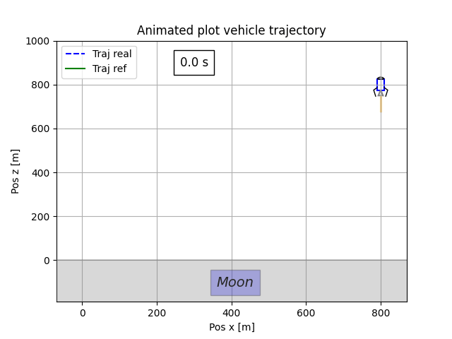

# Lunar-lander-robust-trajectory-tracking

 
 <!--  -->

 ---
## 📌 Overview
In this Python project, we implement robust control laws for the control of a lunar lander subject to significant disturbances and model uncertainties. This project provides dynamical simulations, performance comparison and graphic visualization.

## 🚀 System dynamic description
- TVC-controlled (thrust vector control) landing gear
- 2D modeling

Control variables:
-$\delta$: nozzle steering angle
-$\eta$: mass flow rate at the nozzle outlet

State variables:
-$x$: horizontal position of the landing gear
-$z$: vertical position of the landing gear
-$\theta$: pitch angle of the module body
-$m$: total mass (vehicle + fuel)
-$I$: moment of inertia about pitch

$$
    \begin{bmatrix} \dot{x} \\ 
    \dot{z} \\ 
    \dot{V}_x \\
    \dot{V}_z \\
    \dot{\theta} \\
    \dot{\omega} \\
    \dot{m} \\
    \dot{I} \end{bmatrix} = 
    \begin{bmatrix} V_x \\
    V_z \\ 
    \frac{1}{m} \eta g_0 I_{spv} \cos(\theta+\delta)\\
    -\frac{1}{m} \eta g_0 I_{spv} \sin(\theta+\delta) + g \\
    \omega \\
    -\frac{1}{I} \eta g_0 I_{spv} l_q \cos(\theta+\delta) \\
    -\eta \\
    -l_I^2\eta
    -g \end{bmatrix} 
$$

<!-- ##  🔧 Control loop scheme  </img> -->

### 📊 Controllers Implemented:
- PID
- Feedback linearization

## 📈 Visualize Results

- Tracking second order trajectory using feedback linearization under parameter uncertainties :
  
 </img>

## How to use it

1. Run the main script `main_prog.py` on your favorite Python interpreter.

## 🤝 Contributing

Contributions are welcome!

Future improvements could include:
- NMPC implementation
- Better controller tuning
- Robustness assessment
- More detailled Readme
  <!-- Monte Carlo simulation -->
---
